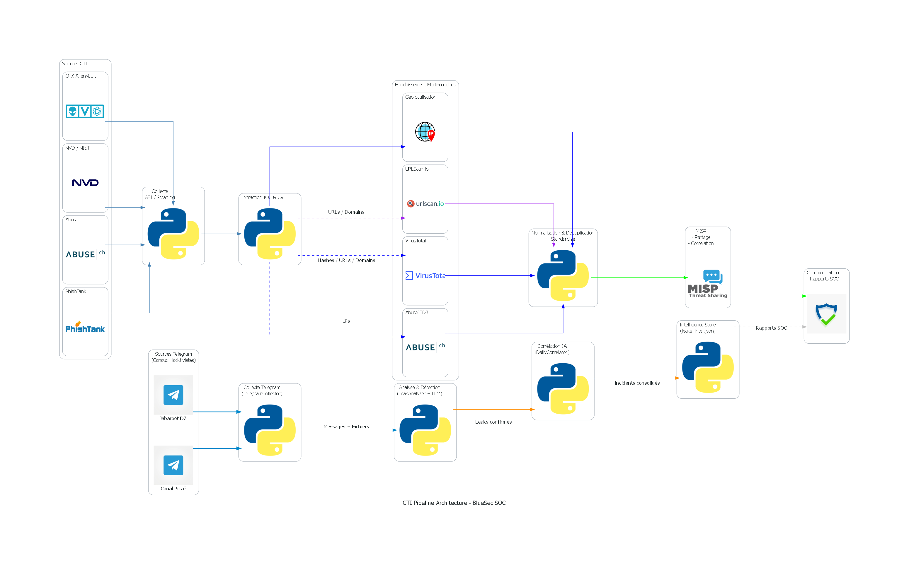
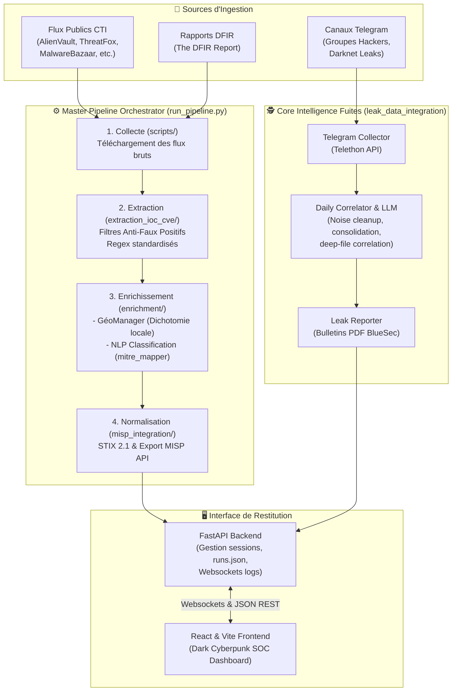

# 🤖 Plateforme d'Orchestration CTI & Threat Leak Intelligence (Cyber-HUD)

> **Projet de Fin d'Études (PFE) — Solution de pointe pour la collecte, l'extraction de haute fidélité, l'enrichissement multi-niveaux et la corrélation par IA des menaces Cyber Threat Intelligence (CTI) et fuites de données.**

---

## 🌌 Aperçu du Projet (Project Overview)

Cette plateforme d'orchestration **Cyber Threat Intelligence (CTI)** est une solution industrielle conçue pour automatiser le cycle de vie complet du renseignement sur les cybermenaces. Elle intègre deux pipelines majeurs :
1. **Pipeline CTI Multi-Sources** : Collecte automatisée depuis plus de 12 flux de menaces mondiaux, extraction d'Indicateurs de Compromission (IoCs) et de CVEs avec filtrage rigoureux contre les faux positifs, enrichissement par géolocalisation à haute performance (<1ms par recherche dichotomique locale), classification sémantique NLP et intégration standardisée **STIX 2.1 / MISP**.
2. **Pipeline Threat Leak Intelligence (Telegram)** : Surveillance en temps réel de canaux Telegram ciblés (crawling asynchrone via Telethon), extraction intelligente de bases de données de fuites, analyse granulaire des fichiers (`.csv`, `.sql`, `.xlsx`) via Pandas pour identifier les données personnelles (CIN, emails, mots de passe), corrélation sémantique par IA (LLM double-passe) pour consolider les campagnes d'attaques, et génération automatisée de bulletins d'alerte PDF professionnels sous le template premium **BlueSec**.

Le tout est piloté par un **Dashboard SOC Interactif** au design moderne et futuriste de style "Cyberpunk/Dark Mode", offrant des télémétries en temps réel, un analyseur CSV à la volée, et un contrôle granulaire de chaque étape du pipeline.

---

## 🛠️ Architecture Technique & Flux de Données

La plateforme repose sur une architecture modulaire et asynchrone, conçue pour minimiser la dépendance aux APIs tierces payantes et maximiser la vitesse d'exécution :





---

## ✨ Fonctionnalités Clés & Composants Majeurs

### 1. Extraction d'IoCs de Haute Fidélité (`extraction_ioc_cve`)
* **Regex Standardisés** : Extraction précise des adresses IP (IPv4/IPv6, avec ports et plages CIDR), domaines, URLs, adresses email, condensats cryptographiques (MD5, SHA-1, SHA-256) et identifiants CVE.
* **Whitelist Intelligente** : Filtrage automatique des domaines légitimes et bénins (ex. Google, Microsoft, Cloudflare, Apple) pour éradiquer les faux positifs.
* **Extraction Centrée IoC** : Les attributs du flux source (score de réputation, catégorie de menace, tags) sont propagés directement dans chaque IoC individuel pour une meilleure granularité.

### 2. Gestionnaire de Géolocalisation Ultra-Rapide (`GeoManager`)
* **Recherche Dichotomique Locale (Binary Search)** : Recherche à complexité logarithmique $O(\log n)$ sur un fichier trié de plages IP mondiales (`geo_base.json`), évitant les requêtes APIs lentes ou payantes.
* **Double Couche de Cache** : Les résolutions d'IPs réussies sont stockées en cache mémoire rapide pour un temps de réponse inférieur à **1 milliseconde**.
* **Données Robustes** : Exploitation combinée de bases de données de confiance (IP2Location, IPVerse, RIR Delegation Stats).

### 3. Intelligence Fuites de Données & Corrélation IA (`leak_data_integration`)
* **Analyse Profonde de Fichiers (Deep-File Correlation)** : Le pipeline inspecte le contenu réel des fichiers exfiltrés associés au leak (`.csv`, `.sql`, `.xlsx` via Pandas). L'IA évalue si les fichiers prouvent la fuite et identifie les types exacts de données compromises (CIN, emails, mots de passe, salaires).
* **Double-Passe LLM Strict & Réduction de Bruit** : 
  1. *Première passe* : Identification et suppression des faux signaux ("NOISE" vs "LEAK") pour ne conserver que les fuites d'organisations d'importance (gouvernementales, grandes entreprises).
  2. *Deuxième passe* : Consolidation globale déterministe et sémantique pour fusionner les doublons et minimiser le nombre d'incidents via une synthèse unique générée par l'IA.
* **Bulletins de Sécurité PDF BlueSec** : Génération automatique de fiches de sécurité au format PDF en utilisant la librairie `FPDF` avec une charte graphique professionnelle ("BlueSec"), incluant les informations sur l'acteur de menace, le niveau de risque, les preuves forensiques et les mesures d'atténuation.

### 4. Dashboard SOC de Haute Qualité Visuelle
* **Aesthetics Premium** : Design immersif Dark Mode, palettes de couleurs harmonieuses (gradients HSL, ombres fines, composants de cartes fluides).
* **Session & Live Telemetry** : Suivi interactif de l'état d'exécution du pipeline master via des flux Websockets bidirectionnels pour visualiser les logs en direct.
* **Visualiseur & Analyseur CSV** : Outil interactif intégré pour charger, visualiser sous forme de table dynamique, et analyser sémantiquement les fichiers CSV massifs.
* **Détail des Incidents** : Vue granulaire de chaque fuite, de la sévérité, des métadonnées de l'acteur de menace, et des fichiers téléchargés.

---

## 📂 Structure du Répertoire (Directory Structure)

```bash
dispostion_CTi/
├── backend/                  # Serveur API FastAPI & Workers
│   ├── app/
│   │   ├── database.py       # Base JSON ultra-rapide (runs.json)
│   │   ├── main.py           # Point d'entrée FastAPI (Uvicorn)
│   │   ├── leaks_router.py   # Routes pour les fuites de données
│   │   ├── websockets.py     # Communication temps réel des logs
│   │   └── worker.py         # Gestionnaire de tâches en arrière-plan
│   ├── requirements.txt      # Dépendances Python Backend
│   └── leak_session.session  # Session Telegram persistante
├── frontend/                 # Application Frontend React (Vite)
│   ├── src/
│   │   ├── pages/            # Dashboard, Leaks, Results, CSVAnalyzer, etc.
│   │   ├── components/       # Composants réutilisables (PipelineFlow, Settings)
│   │   ├── App.jsx           # Racine et routage de l'interface
│   │   └── index.css         # Thème global premium & design tokens
│   ├── package.json          # Dépendances Node.js du Frontend
│   └── vite.config.js        # Configuration du bundler Vite
├── leak_data_integration/    # Pipeline d'Intelligence Telegram & Corrélation LLM
│   ├── core/
│   │   ├── collector.py      # Crawler Telethon asynchrone pour Telegram
│   │   ├── correlator.py     # Double-passe de corrélation & fusion sémantique LLM
│   │   ├── analyzer.py       # Analyseur IA & requêtes LLM
│   │   └── reporter.py       # Moteur de génération des PDF BlueSec (FPDF)
│   ├── results/              # Sorties d'intelligence générées (leaks_intel.json)
│   └── config/               # Fichier settings.yaml pour le profilage des canaux
├── extraction_ioc_cve/       # Moteur d'extraction d'IoCs multi-flux
│   ├── base_extractor.py     # Logique d'extraction générique, regex & whitelists
│   └── *_extractor.py        # Extracteurs spécifiques par flux (ThreatFox, URLhaus...)
├── enrichment/               # Pipeline d'enrichissement
│   ├── geolocalisation/      # GeoManager, base locale geo_base.json & cache
│   └── classification/       # Cartographie MITRE ATT&CK, scorers, fiabilité
├── misp_integration/         # Export STIX 2.1 et synchronisation avec MISP
├── scripts/                  # Scripts automatisés de nettoyage et d'exécution unifiée
├── reports/                  # Bulletins PDF générés (bulletin_*.pdf)
├── runs.json                 # Fichier de persistance des sessions du pipeline
├── run_pipeline.py           # Orchestrateur central du Master Pipeline CTI
└── run_platform.py           # Script de démarrage unifié (Backend + Frontend)
```

---

## 🚀 Guide d'Installation & Démarrage (Quick Start)

### 📋 Prérequis
* **Python 3.10+** (assurez-vous qu'il soit dans vos variables d'environnement)
* **Node.js** (npm) pour le frontend React
* Un compte Telegram (avec `api_id` et `api_hash` obtenus sur [my.telegram.org](https://my.telegram.org)) pour le pipeline de fuites.

### 1. Configuration des Environnements (`.env`)
Créez ou modifiez le fichier `.env` à la racine du projet avec les variables suivantes :

```ini
# --- TELEGRAM API CREDENTIALS ---
TELEGRAM_API_ID=votre_api_id
TELEGRAM_API_HASH=votre_api_hash
TELEGRAM_PHONE=+212xxxxxxxxx # Numéro lié au compte Telegram

# --- LLM API KEYS (Pour la corrélation sémantique) ---
GEMINI_API_KEY=votre_cle_gemini # Ou OpenAI/Anthropic selon configuration

# --- CONFIGURATION PIPELINE ---
LEAK_START_DATE=2026-04-26
DATA_DIR=data
```

### 2. Installation des Dépendances
Installez les packages requis pour le backend et le frontend.

**Backend & Scripts Python :**
```bash
# À la racine du projet
pip install -r backend/requirements.txt
pip install -r leak_data_integration/requirements.txt
```

**Frontend React :**
```bash
# Naviguer dans le dossier frontend et installer les modules
cd frontend
npm install
cd ..
```

---

## 🕹️ Mode d'Emploi (Usage Guide)

### 1. Démarrer la Plateforme Complète (DASHBOARD + API)
Pour lancer simultanément le backend FastAPI (port `8000`) et le frontend React avec rafraîchissement à chaud (port `5173`) :

```bash
python run_platform.py
```
*Accédez à la plateforme via votre navigateur à l'adresse :* [http://localhost:5173](http://localhost:5173)

---

### 2. Exécuter le Master Pipeline CTI (`run_pipeline.py`)
Le pipeline CTI global peut être exécuté étape par étape ou intégralement.

* **Lancer l'ensemble du pipeline** (Collecte -> Extraction -> Enrichissement -> Normalisation STIX) :
  ```bash
  python run_pipeline.py --step all
  ```

* **Exécuter une étape spécifique** :
  ```bash
  # Collecte des flux bruts
  python run_pipeline.py --step collection

  # Extraction des IoCs/CVEs
  python run_pipeline.py --step extraction

  # Enrichissement (Géolocalisation + NLP)
  python run_pipeline.py --step enrichment

  # Normalisation et export MISP
  python run_pipeline.py --step normalisation
  ```

---

### 3. Exécuter le Crawler & Corrélateur de Fuites Telegram
Le script autonome de fuites Telegram collecte les données, analyse les fichiers de fuite, applique la double-passe LLM et consolide les incidents.

```bash
cd leak_data_integration
python main.py --channels "nom_canal_1,nom_canal_2" --start-date "2026-05-01"
```

---

### 4. Générer des Bulletins de Sécurité PDF BlueSec
Pour générer les bulletins PDF professionnels basés sur les fuites collectées depuis la date définie :

```bash
python generate_bulletin.py
```
Les rapports au format texte (`.txt`) et les bulletins graphiques haute définition au format PDF (`.pdf`) seront sauvegardés dans le dossier `/reports/` sous le format `bulletin_<leak_id>.pdf`.

---

## 💎 Décisions d'Architecture Majeures (ADRs)

1. **Recherche Dichotomique locale vs APIs de GéoIP** : Les APIs gratuites de géolocalisation IP limitent les requêtes par minute et ajoutent une latence réseau significative (~200ms). L'utilisation d'une base de données locale d'intervalles d'adresses IP triées combinée à une recherche dichotomique en $O(\log n)$ a réduit ce temps à **<0.5ms par IP**, garantissant une vitesse d'enrichissement inégalée pour des volumes de millions d'IoCs.
2. **Double-Passe LLM pour la Corrélation de Fuites** : La surveillance des canaux Telegram génère un bruit colossal (publicités, fausses alertes, messages de chat). Une simple approche par mots-clés produit d'importants faux positifs. Notre architecture double-passe filtre d'abord le bruit ("NOISE" classification), puis synthétise sémantiquement les rapports pour fusionner les campagnes d'attaques multiples dirigées contre une même entité cible, offrant ainsi une vision claire et condensée à l'analyste SOC.
3. **Persistance ultra-rapide par base JSON (`runs.json`)** : Pour ce projet CTI, une base de données relationnelle complexe aurait ralenti le développement et la portabilité de l'outil. Une base de données JSON optimisée gérée par la classe `JSONDB` permet un accès en lecture/écriture instantané avec une structure de document idéale pour stocker l'historique complet des exécutions du pipeline.

---

*(c) 2026 Projet de Fin d'Études (PFE) - Plateforme Cyber-HUD. Développé avec excellence pour l'analyse avancée des cybermenaces.*
